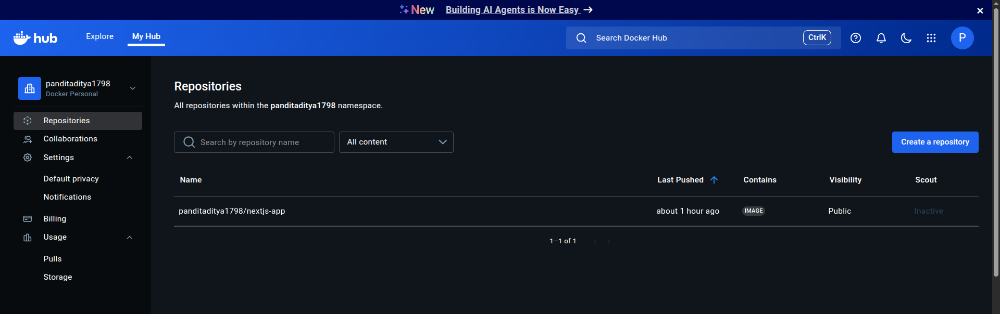
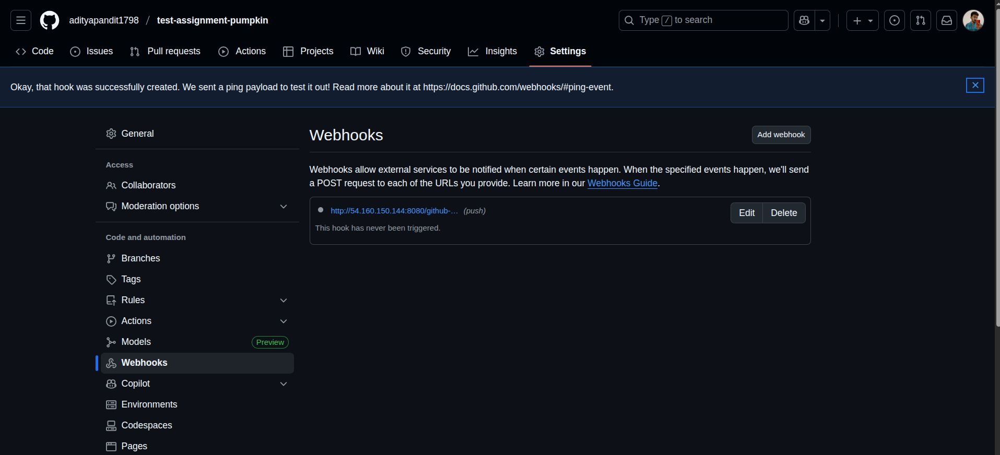
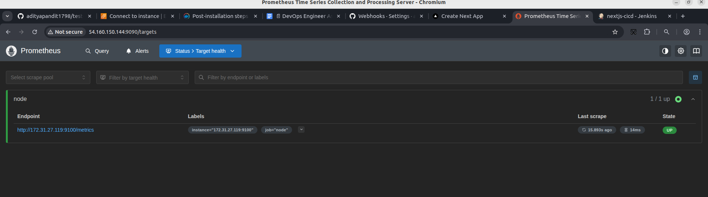
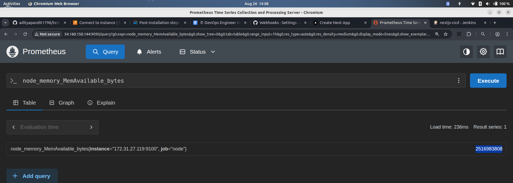
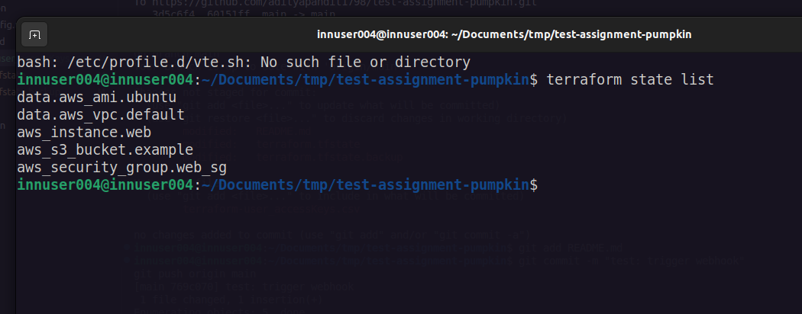

### ✅ **DevOps Engineer Assignment Submission – Aditya Pandit**

I am pleased to submit my completed DevOps assignment, where I successfully deployed a Next.js application on AWS using modern DevOps practices. Below is a detailed summary of the implementation:

---

### 🔧 **1. Infrastructure as Code (Terraform)**

- Provisioned AWS resources using **Terraform**:
  - 1 EC2 instance (Ubuntu, `t2.medium`)
  - 1 S3 bucket
  - Security group allowing SSH (22), HTTP (80), and custom ports (3000, 9090)
- Used **variables and outputs** for reusability and clarity
- Terraform state is managed and infrastructure is version-controlled

---

### 🐳 **2. Containerization (Docker)**

- Created an optimized **multi-stage `Dockerfile`** for the Next.js app
- Used `node:18-alpine` to reduce image size
- Built the app in a builder stage and ran it with a non-root user (`nextjs`) in production
- Ensured `.dockerignore` and proper file copying for efficiency

---

### 🔁 **3. CI/CD Pipeline (Jenkins)**

- Set up **Jenkins on EC2** to automate deployments
- Created a pipeline that:
  - Triggers on every **GitHub commit**
  - Builds the Docker image
  - Pushes to **Docker Hub** (`panditaditya1798/nextjs-app`)
  - Deploys the new container to EC2
- Used **Jenkins credentials store** for secure Docker Hub login
- Configured **GitHub webhook** for automatic triggering

---

### 📊 **4. Monitoring & Logging**

- Deployed **Prometheus + Node Exporter** in Docker containers
- Exposed and visualized key metrics:
  - CPU usage: `rate(node_cpu_seconds_total[1m])`
  - Memory availability: `node_memory_MemAvailable_bytes`
- Configured **simple logging**:
  - Logs stored via Docker’s `local` logging driver
  - Log rotation enabled (`max-size=100m`, `max-file=3`)
  - Logs accessible at `/home/ubuntu/monitoring/logs`

---

### 🔐 **5. Security & Best Practices**

- **No hardcoded secrets**: Used Jenkins credentials and Docker Hub access tokens
- **Non-root containers**: App runs as `nextjs` user
- **Minimal attack surface**: Security group restricts access to necessary ports
- **Clean code & config**: All infrastructure, Docker, and monitoring configs are in version control

---

### 📂 **GitHub Repository**

🔗 **Repo**: [https://github.com/adityapandit1798/test-assignment-pumpkin](https://github.com/adityapandit1798/test-assignment-pumpkin)

Includes:
- `main.tf` – Terraform infrastructure
- `Dockerfile` – Optimized container build
- `Jenkinsfile` – Full CI/CD pipeline
- `monitoring/prometheus.yml` – Prometheus configuration
- Screenshots and documentation

---

### 🖼️ **Proof of Work (Screenshots Attached)**

1. `terraform apply` output – Infrastructure provisioned
2. `docker ps` – All containers running (app, Prometheus, Node Exporter)
3. GitHub webhook configured
4. Jenkins pipeline success (green build)
5. Docker Hub image pushed
6. Terraform state list
7. Next.js app running in browser (`http://<ec2-ip>:3000`)
8. Prometheus targets page – Node Exporter UP
9. Prometheus graph – CPU/Memory metrics visible

---

### 🚀 Summary

This project demonstrates a **production-ready DevOps workflow** covering:
- Infrastructure automation
- Secure containerization
- Automated CI/CD
- Observability & logging
- Security best practices

All components are working in real-time on AWS.

---

Let me know if you'd like the **live IP address**, **Jenkins login details**, or to **walk through the setup**.

Thank you for the opportunity — I look forward to discussing this further!

## 🖼️ Screenshots

| Description | Screenshot |
|-----------|------------|
| Terraform Apply Output |  |
| Docker Containers Running |  |
| GitHub Webhook Configured |  |
| Jenkins Pipeline Success |  |
| Docker Hub Repository |  |
| Terraform State List |  |
| Next.js App Running |  |
| Prometheus Targets |  |
| Prometheus Graph |  |

Best regards,  
**Aditya Pandit**  

